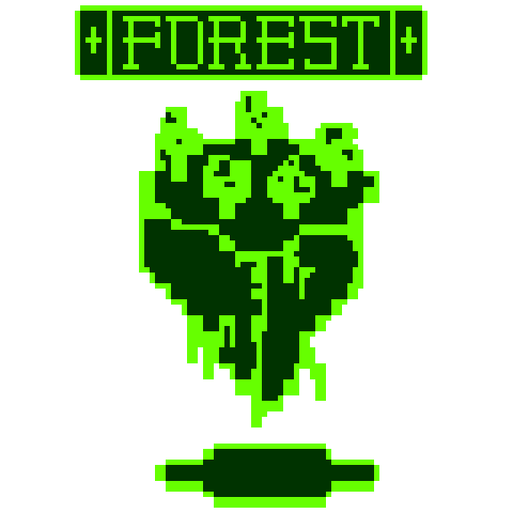

# forest-client
A client app for the RESTful forest api, found here: http://restful-forest.herokuapp.com/

## Introduction

This is the decoupled React client for a project currently under active development.

Inspired by certain aspects of Dwarf Fortress, Minecraft, and [Proteus](http://twistedtreegames.com/proteus/), and A Dark Room. A read-only experience where someone can walk through a rich environment, looking closely at objects and animals, their histories, and relationships with each other.

[Click here to see the API on Heroku!](http://restful-forest.herokuapp.com/api/v1/location?x=1&y=1)

[You can read about development on here on my dev partner's blog](https://vcolavin.wordpress.com/tag/dev-blog/)

## API response

API is HATEOAS (Hypermedia as the Engine of Application State), which means the responses look like this:

```
  "message": "some generated message yay",
  "data": {
    "location": {
      "x": 1,
      "y": 2,
      "actions": {
        "north_url": "/locations?x=1&y=3",
        "south_url": "/locations?x=1&y=3",
        ...
      },
      "objects": [
      {
        "kind": "tree",
        "actions": {"details_url": "/trees/3"}
      },
      {
        "kind": "wolf",
        "name": "jandice",
        "actions": {
          "details_url": "/wolves/4",
          "say_hello_url": "/wolves/4/say_hello"
        }
      }]
    }
  }
```

This allows for the client to traverse the forest using the API exlusively.
